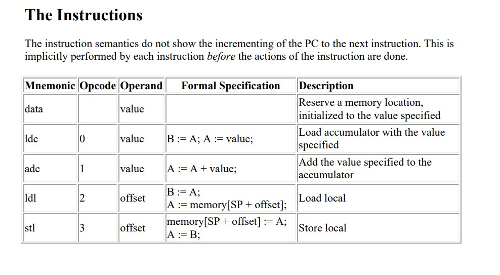
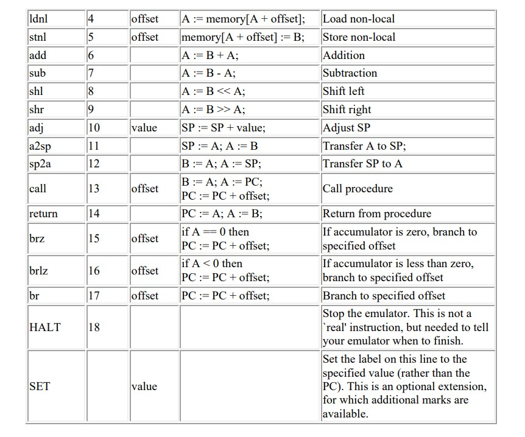

# 2Pass-Assembler-and-Emulator
A 2 pass Assembler for a custom assembly language called SIMPLE 
(SIMPLE has 2 registers, program counter, stack counter and selected mnemonics which perform various operations)

##### The List of Instructions provided

and an Emulator which emulates the assembled instructions and has multiple display modes
